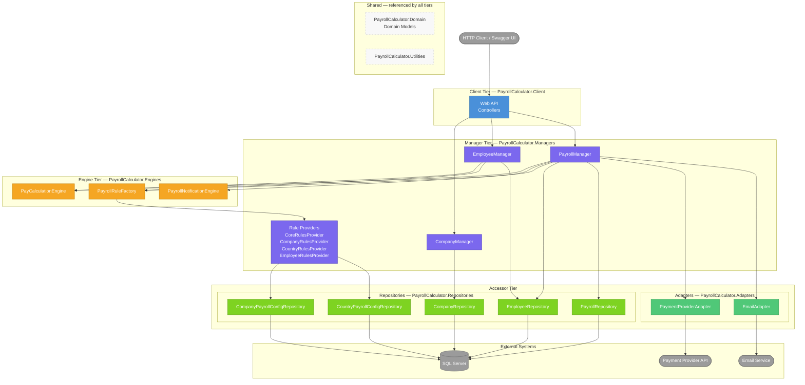

# System Architecture — IDesign Decomposition

> Shows all components grouped by IDesign tier and the only call directions that are permitted. Use this as the canonical reference during code review — any dependency that does not appear here is a design violation.

## IDesign Call Rules

| Layer | May Call | May NOT Call |
|---|---|---|
| **Client** | Managers only | Engines, Repositories, Adapters |
| **Manager** | Engines, Repositories, Adapters | Other Managers |
| **Engine** | Nothing (pure logic, value-in/value-out) | Repositories, Adapters, Managers |
| **Repository** | External DB only | Engines, Adapters, other Repositories |
| **Adapter** | External services only | Engines, Repositories, other Adapters |

## Forbidden Calls Checklist

Use during code review to verify no shortcut dependencies were introduced:

- [ ] No Controller/API class injects or calls an Engine, Repository, or Adapter directly
- [ ] No Manager calls another Manager
- [ ] No Engine has a dependency on a Repository, Adapter, or Manager
- [ ] No Repository calls another Repository, an Engine, or an Adapter
- [ ] No Adapter calls a Repository, Engine, or another Adapter

## Diagram

## Key Design Decisions

1. **PayrollManager is the only orchestrator for payroll runs.** It calls both Adapters (payment, email) — this is deliberate. No separate "PaymentManager" or "EmailManager" exists because IDesign forbids Manager-to-Manager calls, and these are not independent use cases.

2. **Engines are pure — no entity data crosses the engine boundary.** `PayCalculationEngine.Calculate` receives only pre-configured rule objects; it never sees an `Employee` or `Company`. All entity data is loaded by providers (Manager tier) and baked into rule constructors before the engine is called. See [04-rules-providers.md](04-rules-providers.md).

3. **Rule providers own all data-loading for pay calculation.** `CoreRulesProvider`, `CompanyRulesProvider`, `CountryRulesProvider`, and `EmployeeRulesProvider` call their respective repositories and inject loaded values (salary, tax rate, minimum wage) into rule constructors. The engine never needs to know where those values came from.

4. **Adapters are treated as Accessors.** They sit in the same tier as Repositories and are called only by Managers.

5. **`PayrollRuleFactory` aggregates providers via DI.** All registered `IPayrollRuleProvider` implementations are injected as a collection. Adding a new provider is a two-step operation: implement `IPayrollRuleProvider` and register it in `Program.cs` — no factory code changes.
