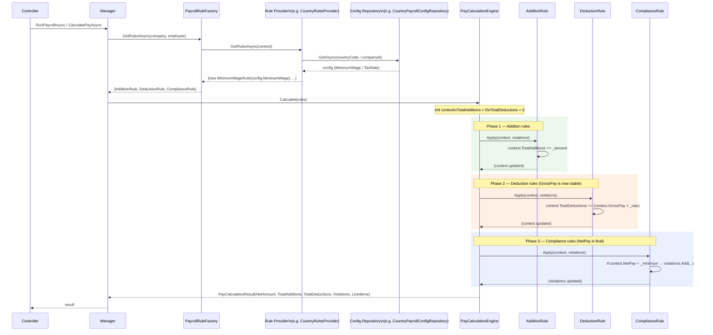

# Pay Calculation Engine — Design

> Describes how `PayCalculationEngine`, `IPayrollRule`, and the rule provider pipeline work together to produce a payslip calculation. Use this as the reference when adding new rules or debugging calculation outcomes.

---

## Purpose

`PayCalculationEngine` is a pure engine — it takes a list of pre-configured rules, applies them in the correct order, and returns a result. It performs no I/O, holds no state, and has no dependencies on repositories, adapters, or entity data.

```
Pre-configured Rules  →  PayCalculationEngine  →  PayCalculationResult
```

All entity data (employee salary, company tax rate, country minimum wage) is loaded by the rule providers before `Calculate` is called. See [04-rules-providers.md](04-rules-providers.md).

---

## Core Concept: Rules Are Everything

The engine does not receive an employee record, separate additions collections, or raw deduction amounts. Instead, **every pay adjustment is a rule**, and every rule carries its own pre-loaded value. A rule can:

| Effect | What it does | Examples |
|---|---|---|
| `Addition` | Increases the employee's gross pay | Base salary, bonus, overtime allowance, travel allowance |
| `Deduction` | Reduces net pay after gross is finalised | Tax, pension deduction, medical aid contribution |
| `Compliance` | Validates the result; does not change any amounts | Minimum wage check, legal net-pay floor |

A `MinimumWageRule` built for a Denmark employee carries that country's legal minimum; one built for a Sweden employee carries Sweden's. They are the same class — the threshold is injected by the provider at construction time.

---

## Why Phase Order Matters

Rules are applied in three sequential phases:

```
Phase 1: Addition rules   →   Phase 2: Deduction rules   →   Phase 3: Compliance rules
```

**Phase 1 must complete before Phase 2 begins.** Tax (a Deduction rule) is calculated as a percentage of *gross pay* — base salary plus all additions. If a bonus was not yet applied when the tax rule ran, the tax would be understated.

**Phase 2 must complete before Phase 3 begins.** Compliance rules check the *final* net pay. If they ran before deductions, they would be checking an inflated number.

---

## PayCalculationContext — Accumulator Pattern

The context is passed to every rule. Rules update its accumulators; they never set `NetPay` or `GrossPay` directly — those are derived properties. The context holds no entity data — rules already carry everything they need.

```csharp
public record PayCalculationContext
{
    public decimal TotalAdditions  { get; set; }   // sum of all Addition rule amounts
    public decimal TotalDeductions { get; set; }   // sum of all Deduction rule amounts

    // Derived — read-only to rules
    public decimal GrossPay => TotalAdditions;
    public decimal NetPay   => GrossPay - TotalDeductions;

    public List<PayslipLineItem> LineItems { get; } = [];
}
```

An Addition rule writes: `context.TotalAdditions += amount;`  
A Deduction rule writes: `context.TotalDeductions += amount;`  
A Compliance rule only reads `context.NetPay` — it never writes anything.

---

## IPayrollRule Interface

```csharp
public interface IPayrollRule
{
    PayrollRuleEffect Effect { get; }
    void Apply(PayCalculationContext context, IList<RuleViolation> violations);
}

public enum PayrollRuleEffect { Addition, Deduction, Compliance }
```

`Effect` tells the engine which phase to run this rule in.  
`Apply` performs the rule's logic — updating accumulators or appending violations — using values the rule already holds from construction.

---

## Engine Execution Flow

```
1. Initialise context: TotalAdditions = 0, TotalDeductions = 0, LineItems = []

2. Apply all Addition rules  (context.GrossPay rises with each rule)

3. Apply all Deduction rules (context.NetPay falls with each rule; GrossPay is now stable)

4. Apply all Compliance rules (read final context.NetPay; append violations if needed)

5. Return PayCalculationResult:
     NetAmount        = context.NetPay
     TotalAdditions   = context.TotalAdditions
     TotalDeductions  = context.TotalDeductions
     Violations       = collected violations
     LineItems        = context.LineItems
```

The order rules are provided within a phase does not matter for correctness unless one rule in the same phase depends on another's output — in practice, rules within a phase are independent.

---

## PayCalculationResult

| Field | Meaning |
|---|---|
| `NetAmount` | The final take-home pay after all additions, deductions, and tax |
| `TotalAdditions` | Sum of all amounts added by Addition rules |
| `TotalDeductions` | Sum of all amounts deducted by Deduction rules (including tax) |
| `Violations` | List of compliance issues; a non-empty list does **not** block payment — it flags a problem for review |
| `LineItems` | One entry per rule that produced an amount — used to build the payslip breakdown |

---

## Manager's Role

The manager calls the engine as part of a larger workflow:

```
1. Fetch the employee and company records from the database
2. Ask PayrollRuleFactory for the applicable rules
   └─ Factory calls each provider; providers load config from DB and construct rules with values baked in
3. Call PayCalculationEngine.Calculate(rules)
4. Persist payslip, process payment, send email
```

The manager knows nothing about rule logic. It only assembles inputs and passes them to the engine. See [04-rules-providers.md](04-rules-providers.md) for how rules are built.

---

## How to Add a New Rule

1. Create a class in `PayrollCalculator.Engines/Rules/<Scope>/` that implements `IPayrollRule`.
2. Set `Effect` to `Addition`, `Deduction`, or `Compliance`.
3. Inject any data-driven parameters (amounts, rates, thresholds) via the constructor — never read from context at apply-time.
4. Implement `Apply`: update `context.TotalAdditions`, `context.TotalDeductions`, or append to `violations`.
5. In the appropriate provider (Core / Company / Country / Employee), load the parameter value from its repository and pass it to the rule constructor.

```csharp
// Example: a flat monthly bonus loaded per employee
public class MonthlyBonusRule(decimal bonusAmount) : IPayrollRule
{
    public PayrollRuleEffect Effect => PayrollRuleEffect.Addition;

    public void Apply(PayCalculationContext context, IList<RuleViolation> violations)
    {
        context.TotalAdditions += bonusAmount;
        context.LineItems.Add(new PayslipLineItem
        {
            RuleName    = nameof(MonthlyBonusRule),
            Description = "Monthly bonus",
            Amount      = bonusAmount,
            Kind        = PayslipLineItemKind.Addition
        });
    }
}
```

---

## Sequence Diagram



---

## Worked Example

**Employee in South Africa:** BaseSalary = R5 000, eligible for a R500 monthly bonus  
**Rules assembled by providers:**
- `BaseSalaryRule(5000)` — Addition (from CoreRulesProvider)
- `MonthlyBonusRule(500)` — Addition (from EmployeeRulesProvider, loaded from DB)
- `FlatTaxRule(0.20m)` — Deduction (from CompanyRulesProvider, loaded from DB)
- `MinimumWageRule(1500)` — Compliance (from CountryRulesProvider, loaded from DB for ZA)

**Phase 1 — Additions:**

| Rule | Amount added | TotalAdditions | GrossPay |
|---|---|---|---|
| BaseSalaryRule | R5 000 | R5 000 | R5 000 |
| MonthlyBonusRule | R500 | R5 500 | R5 500 |

**Phase 2 — Deductions:**

| Rule | Amount deducted | TotalDeductions | NetPay |
|---|---|---|---|
| FlatTaxRule (20% of R5 500) | R1 100 | R1 100 | R4 400 |

**Phase 3 — Compliance:**

| Rule | Check | Violation? |
|---|---|---|
| MinimumWageRule (min R1 500) | R4 400 ≥ R1 500 | No |

**Result:**

```
NetAmount       = R4 400
TotalAdditions  = R5 500
TotalDeductions = R1 100
Violations      = []
LineItems       = [BaseSalary R5000, MonthlyBonus R500, FlatTax R1100]
```
