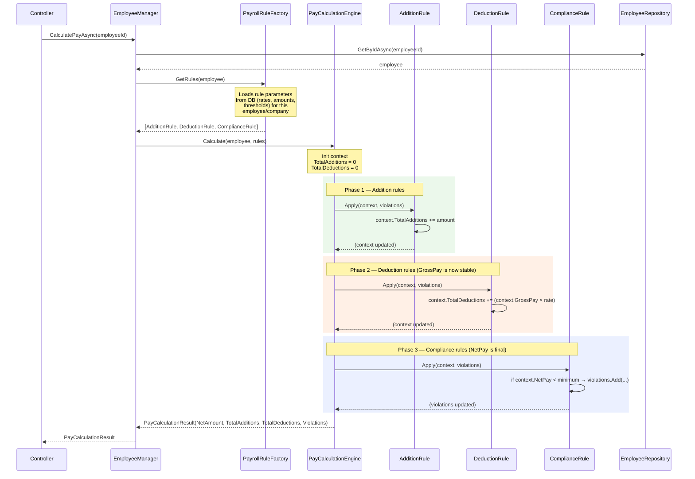

# Pay Calculation Engine — Design

> Describes how `PayCalculationEngine`, `IPayrollRule`, and `EmployeeManager` work together to produce a payslip calculation. Use this as the reference when adding new rules or debugging calculation outcomes.

---

## Purpose

`PayCalculationEngine` is a pure engine — it takes an employee and a list of rules, applies them in the correct order, and returns a result. It performs no I/O, holds no state, and has no dependencies on repositories or adapters.

```
Employee + Rules  →  PayCalculationEngine  →  PayCalculationResult
```

---

## Core Concept: Rules Are Everything

The engine does not receive separate additions or deductions as data collections. Instead, **every pay adjustment is a rule**. A rule can:

| Effect | What it does | Examples |
|---|---|---|
| `Addition` | Increases the employee's gross pay | Bonus, overtime allowance, travel allowance |
| `Deduction` | Reduces net pay after gross is finalised | Tax, pension deduction, medical aid contribution |
| `Compliance` | Validates the result; does not change any amounts | Minimum wage check, legal net-pay floor |

This means a single rule class can serve any company or region — the amount or threshold it uses is injected at construction time and comes from the database. A `MinimumWageRule` built for Company A may carry a different legal minimum than the one built for Company B, but they are the same class.

---

## Why Phase Order Matters

Rules are applied in three sequential phases:

```
Phase 1: Addition rules   →   Phase 2: Deduction rules   →   Phase 3: Compliance rules
```

**Phase 1 must complete before Phase 2 begins.** Tax (a Deduction rule) is calculated as a percentage of *gross pay* — BaseSalary plus all additions. If a bonus was not yet applied when the tax rule ran, the tax would be understated and the payslip would be wrong.

**Phase 2 must complete before Phase 3 begins.** Compliance rules check the *final* net pay. If they ran before deductions, they would be checking an inflated number.

---

## PayCalculationContext — Accumulator Pattern

The context is passed to every rule. Rules update its accumulators; they never set `NetPay` or `GrossPay` directly — those are derived properties.

```csharp
public record PayCalculationContext
{
    public Employee Employee      { get; init; } = null!;
    public decimal TotalAdditions { get; set; }   // sum of all Addition rule amounts
    public decimal TotalDeductions{ get; set; }   // sum of all Deduction rule amounts

    // Derived — read-only to rules
    public decimal GrossPay => Employee.BaseSalary + TotalAdditions;
    public decimal NetPay   => GrossPay - TotalDeductions;
}
```

An Addition rule writes: `context.TotalAdditions += amount;`  
A Deduction rule writes: `context.TotalDeductions += amount;`  
A Compliance rule only reads `context.NetPay` — it never writes anything.

---

## IPayrollRule Interface

```csharp
public interface IPayrollRule
{
    PayrollRuleEffect Effect { get; }
    void Apply(PayCalculationContext context, IList<RuleViolation> violations);
}

public enum PayrollRuleEffect { Addition, Deduction, Compliance }
```

`Effect` tells the engine which phase to run this rule in.  
`Apply` performs the rule's logic — updating accumulators or appending violations.

---

## Engine Execution Flow

```
1. Initialise context: Employee = employee, TotalAdditions = 0, TotalDeductions = 0

2. Apply all Addition rules  (context.GrossPay rises with each rule)

3. Apply all Deduction rules (context.NetPay falls with each rule; GrossPay is now stable)

4. Apply all Compliance rules (read final context.NetPay; append violations if needed)

5. Return PayCalculationResult:
     NetAmount        = context.NetPay
     TotalAdditions   = context.TotalAdditions
     TotalDeductions  = context.TotalDeductions
     Violations       = collected violations
```

The order rules are provided within a phase does not matter for correctness unless one rule in the same phase depends on another's output — in practice, rules within a phase are independent.

---

## PayCalculationResult

| Field | Meaning |
|---|---|
| `NetAmount` | The final take-home pay after all additions, deductions, and tax |
| `TotalAdditions` | Sum of all amounts added by Addition rules |
| `TotalDeductions` | Sum of all amounts deducted by Deduction rules (including tax) |
| `Violations` | List of compliance issues; a non-empty list does **not** block payment — it flags a problem for review |

---

## Manager's Role

`EmployeeManager.CalculatePayAsync` is the caller:

```
1. Fetch the employee record from the database
2. Ask PayrollRuleFactory for the applicable rules (factory loads rule data from DB)
3. Call PayCalculationEngine.Calculate(employee, rules)
4. Return the result to the controller
```

The manager knows nothing about rule logic. It only assembles the inputs and passes them to the engine. `PayrollRuleFactory` is where the decision is made about which rules apply to an employee and with what parameters (e.g. which minimum wage applies to this company's jurisdiction).

---

## How to Add a New Rule

1. Create a class in `PayrollCalculator.Engines/Rules/` that implements `IPayrollRule`.
2. Set `Effect` to `Addition`, `Deduction`, or `Compliance`.
3. Inject any data-driven parameters (amounts, rates, thresholds) via the constructor.
4. Implement `Apply`: update `context.TotalAdditions`, `context.TotalDeductions`, or append to `violations`.
5. Register the rule in `PayrollRuleFactory.GetRules()`, passing it the relevant DB-loaded value.

```csharp
// Example: a flat monthly bonus
public class MonthlyBonusRule(decimal bonusAmount) : IPayrollRule
{
    public PayrollRuleEffect Effect => PayrollRuleEffect.Addition;

    public void Apply(PayCalculationContext context, IList<RuleViolation> violations)
    {
        context.TotalAdditions += bonusAmount;
    }
}
```

---

## Sequence Diagram



---

## Worked Example

**Employee:** BaseSalary = R5 000  
**Rules applied:**
- `MonthlyBonusRule(500)` — Addition
- `FlatTaxRule(0.20m)` — Deduction
- `MinimumWageRule(1500)` — Compliance

**Phase 1 — Additions:**

| After MonthlyBonusRule | TotalAdditions | GrossPay |
|---|---|---|
| | R500 | R5 500 |

**Phase 2 — Deductions:**

| After FlatTaxRule (20% of R5 500) | TotalDeductions | NetPay |
|---|---|---|
| | R1 100 | R4 400 |

**Phase 3 — Compliance:**

| MinimumWageRule (min R1 500) | Violation? |
|---|---|
| NetPay R4 400 ≥ R1 500 | No |

**Result:**

```
NetAmount       = R4 400
TotalAdditions  = R500
TotalDeductions = R1 100
Violations      = []
```
